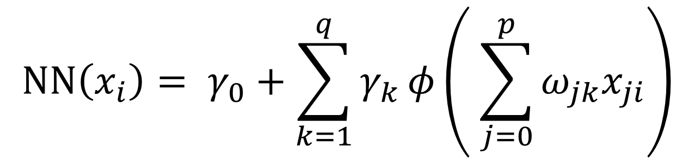
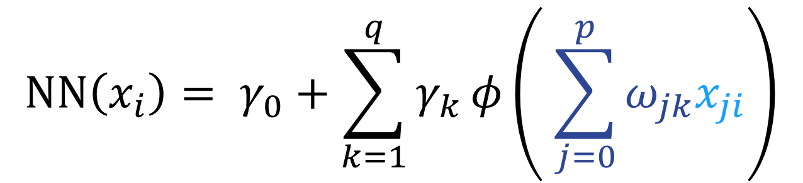
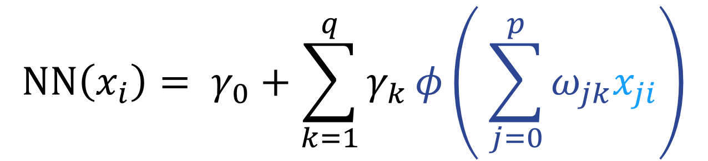

```{r, echo=FALSE, message=FALSE}
library(knitr)
library(fontawesome)
# the default output hook
hook_output <- knit_hooks$get('output')
knit_hooks$set(output = function(x, options) {
  if (!is.null(n <- options$out.lines)) {
    n <- as.numeric(n)
    x <- unlist(stringr::str_split(x, "\n"))
    nx <- length(x) 
    x <- x[pmin(n,nx)]
    if(min(n) > 1)  
      x <- c(paste(options$comment, "[...]"), x)
    if(max(n) < nx) 
      x <- c(x, paste(options$comment, "[...]"))
    x <- paste(c(x, "\n"), collapse = "\n")
  }
  hook_output(x, options)
    })
```

```{r, echo = FALSE}
library(interpretnn)
```


```{r analysis, include=FALSE, cache=TRUE}

# load packages -----------------------------------------------------------
library(interpretnn)
library(caret)
library(selectnn)

set.seed(1)

# load data ---------------------------------------------------------------
insurance <- read.csv("insurance.csv",
                      stringsAsFactors = TRUE)

dummy <- dummyVars(" ~ .", data = insurance)
insurance <- data.frame(predict(dummy, newdata = insurance)) 


# prep data --------------------------------------------------------

std_X <- caret::preProcess(insurance[, c(1, 4, 5)])

std_y <- caret::preProcess(data.frame("charges" = insurance[, 12]))

X <- as.matrix(predict(std_X, insurance[, c(1, 4, 5)]))
X <- cbind(X, insurance[, c(3, 7, 9:11)])
X <- X[, c(1, 4, 2, 3, 5, 6:8)]
y <- as.matrix(predict(std_y, data.frame("charges" = insurance[, 12])))
df <- as.data.frame(cbind(X, y))

# selectnn ----------------------------------------------------------------
set.seed(2)
nn <- selectnn(charges ~ ., data = df, Q = 8, n_init = 5)
summary(nn)


interpretnn.default <- function(object, B = 100, ...) {
  
  stnn <- interpretnn(object$nn, X = object$x, y = object$y, B = B)
  
  return(stnn)
}

# interpretnn -------------------------------------------------------------

n_init <- 10
q <- 2 # achieves VC that is positive definite

lambda <- 0.1


inn <- nn_fit(X, y, q, n_init, maxit = 2000, lambda = lambda)

intnn <- interpretnn.default(inn)

summary(intnn, wald_single_par = TRUE)
```

class: title-slide, left, bottom

# `r rmarkdown::metadata$title`
----
## **`r rmarkdown::metadata$author`**, **`r rmarkdown::metadata$coauthor`**
### `r rmarkdown::metadata$institution`
#### `r rmarkdown::metadata$event`, `r rmarkdown::metadata$date`


---
# Feedforward Neural Networks 

--

.left-column[ 
```{r, echo=FALSE, out.width="100%", out.height="110%", fig.align="center"}
knitr::include_graphics("img/FNN.png")
``` 
]

<br>


--

.right-column[ 
```{r, echo=FALSE, out.width="95%", out.height="100%", fig.align="right"}

```  
]

---
count: false
# Feedforward Neural Networks 


.left-column[ 
```{r, echo=FALSE, out.width="100%", out.height="110%", fig.align="center"}
knitr::include_graphics("img/FNN.png")
``` 
]

<br>


.right-column[ 
```{r, echo=FALSE, out.width="95%", out.height="100%", fig.align="right"}
knitr::include_graphics("img/nneq2.png")
```  
]

---
count: false
# Feedforward Neural Networks 


.left-column[ 
```{r, echo=FALSE, out.width="100%", out.height="110%", fig.align="center"}
knitr::include_graphics("img/FNN.png")
``` 
]

<br>


.right-column[ 
```{r, echo=FALSE, out.width="95%", out.height="100%", fig.align="right"}

```  
]

---
count: false
# Feedforward Neural Networks 


.left-column[ 
```{r, echo=FALSE, out.width="100%", out.height="110%", fig.align="center"}
knitr::include_graphics("img/FNN.png")
``` 
]

<br>


.right-column[ 
```{r, echo=FALSE, out.width="95%", out.height="100%", fig.align="right"}

```  
]

---
count: false
# Feedforward Neural Networks 


.left-column[ 
```{r, echo=FALSE, out.width="100%", out.height="110%", fig.align="center"}
knitr::include_graphics("img/FNN.png")
``` 
]

<br>


.right-column[ 
```{r, echo=FALSE, out.width="95%", out.height="100%", fig.align="right"}
knitr::include_graphics("img/nneq5.png")
```  
]

---

# Data Application 

--

### Insurance Data (Kaggle)

--

1,338 beneficiaries enrolled in an insurance plan  

--

 
Response:  `charges`   

--

6 Explanatory Variables:
.pull-left[
- `age` 

- `sex`   

- `bmi` 

]

.pull-left[

- `children` 

- `smoker`   

- `region` 

]


---

# R Implementation

--

Many packages available to fit neural networks in R.

<br>
--

Some popular packages are:

--

-  `nnet`

--

-  `neuralnet`

--

-  `keras`

--

-  `torch`

---

# R Implementation: nnet

--

```{r nnet, echo = TRUE, eval = FALSE}
library(nnet)
nn <- nnet(charges ~ ., data = insurance, size = 2, maxit = 2000,
           linout = TRUE)
summary(nn)
```

--

```{r nnetmodel, eval = TRUE, echo = FALSE, class.output = "bg-primary", cache=TRUE}
cat(c(capture.output(summary(inn$nn))[-2], "[...]"),
    sep = "\n")
```


---


# Proposed Solution: interpretnn

--

.left-column[ 
<br>
```{r, echo=FALSE, out.width="80%", fig.align="center"}

``` 
]

--

.right-column[
<br>
<br>
```{r, echo=TRUE, eval = FALSE}
# install.packages("devtools")
library(devtools)
install_github("andrew-mcinerney/interpretnn")
``` 
]


---

# Statistical Perspective

--

$$
y_i = \text{NN}(x_i) + \varepsilon_i, 
$$

--

where

$$
\varepsilon_i \sim N(0, \sigma^2)
$$

<br>

--

$$
\ell(\theta, \sigma^2)= -\frac{n}{2}\log(2\pi\sigma^2)-\frac{1}{2\sigma^2}\sum_{i=1}^n(y_i-\text{NN}(x_i))^2
$$

---

# Uncertainty Quantification

Then, as $n \to \infty$

$$
\hat{\theta} \sim N[\theta, \Sigma = \mathcal{I}(\theta)^{-1}]
$$

--

Estimate $\Sigma$ using

$$
\hat{\Sigma} = I_o(\hat{\theta})^{-1}
$$

--

<br>  

However, inverting $I_o(\hat{\theta})$ can be problematic in neural networks.
---

# Redundancy

--

Redundant hidden nodes can lead to issues of unidentifiability for some of the parameters (Fukumizu 1996).

<br>

--

Redundant hidden nodes $\implies$ Singular information matrix.

<br>

--

Trade-off between model flexibility and interpretability.


---

# Significance Testing

--

.pull-left[
```{r, echo=FALSE, out.width="100%", fig.align="center"}
knitr::include_graphics("img/FNN1.png")
``` 
]

---
count: false
# Significance Testing


.pull-left[
```{r, echo=FALSE, out.width="100%", fig.align="center"}
knitr::include_graphics("img/FNN2.png")
``` 
]

--

.pull-right[
  Wald test:
  
  {{content}}
  
  ]

--

$$
\begin{equation}
 \omega_j = (\omega_{j1},\omega_{j2},\dotsc,\omega_{jq})^T
\end{equation}
$$
{{content}}

--

$$
\begin{equation}
 H_0: \omega_j = 0
\end{equation}
$$
{{content}}

--

$$
\begin{equation}
 (\hat{\omega}_{j} - \omega_j)^T\Sigma_{\hat{\omega}_{j}}^{-1}(\hat{\omega}_{j} - \omega_j) \sim \chi^2_q
\end{equation}
$$
{{content}}


---


# Insurance: Model Summary 


```{r, message = FALSE, eval = FALSE, tidy = FALSE}
intnn <- interpretnn(nn)  
summary(intnn)
```

--

```{r summst, echo = FALSE, cache = TRUE, class.output = "bg-primary"}
s <- summary(intnn, wald_single_par = TRUE)$coefdf
s[, 5] <- round(s[, 5], 4)


cat(c(capture.output(summary(intnn))[9],
      capture.output(print(s[, c(1, 7, 4, 5, 6)], row.names = FALSE)),
      capture.output(summary(intnn))[20:21])
    , sep = "\n")  

```

---


# Insurance: Model Summary 


```{r, message = FALSE, eval = FALSE, tidy = FALSE}
plotnn(intnn)
```

--

```{r, echo=FALSE, out.width="90%", fig.align="center"}
knitr::include_graphics("img/plotnn-1.png")
``` 


---

# Covariate-Effect Plots


$$
\begin{equation}
 \widehat{\overline{\text{NN}}}_j(x) = \frac{1}{n}\sum_{i=1}^n \text{NN}(x_{i,1}, \ldots,x_{i,j-1},x, x_{i,j+1}, \ldots)
\end{equation}
$$

--
Propose covariate-effect plots of the following form:

--

$$
\begin{equation}
 \hat{\beta}_j(x,d) =\widehat{\overline{\text{NN}}}_j(x + d) -\widehat{\overline{\text{NN}}}_j(x)
\end{equation}
$$

--

Usually set $d = \text{SD}(x_j)$


---

# Insurance: Covariate Effects 


```{r, eval = FALSE}
plot(intnn, conf_int = TRUE, which = c(1, 4))
```  

--

.pull-left[ 
```{r plot1, cache = TRUE, echo = FALSE, fig.height = 6}
par(mar=c(5,6,4,2)+.1) 
plot(intnn, which = 1, xaxt = "n", conf_int = TRUE, ylim = c(0, 0.5), cex.axis = 1.7,
     cex.caption = 2.5, cex.lab = 2.2)
rug(jitter(intnn$X$age, factor = 2.5))
axis(1, at= c(-1.5, -1, -0.5, 0, 0.5, 1, 1.5),
     labels=c(17.5, 25, 32.5, 40, 47.5, 55, 62.5), cex.axis = 1.7)
```  
]  

--

.pull-right[ 
```{r plot2, cache = TRUE, echo = FALSE, fig.height = 6}
par(mar=c(5,6,4,2)+.1) 
plot(intnn, which = 4, xaxt = "n", conf_int = TRUE, ylim = c(0, 0.5), cex.axis = 1.7,
     cex.caption = 2.5, cex.lab = 2.2)
rug(jitter(intnn$X$children))
axis(1, at= c(-0.90827, -0.0787, 0.751, 1.58, 2.41, 3.24), labels=0:5, cex.axis = 1.7)
```  
] 

---
# Summary

--

* Statistical-modelling approach to neural networks

<br>
--

* Provide an R package to improve interpretability

<br>
--

* Make neural networks more familiar in a statistical-modelling context

---
class: bigger
# References

*  McInerney, A., & Burke, K. (2022). A statistically-based approach to feedforward neural network model selection. arXiv preprint arXiv:2207.04248.    

*  McInerney, A., & Burke, K. (2023). Interpreting feedforward neural networks as statistical models. In Preparation.    


### R Package  

```{r, eval = FALSE}
devtools::install_github("andrew-mcinerney/interpretnn")
```


`r fa(name = "github", fill = "#007DBA")` <font size="5.5">andrew-mcinerney</font>   `r fa(name = "twitter", fill = "#007DBA")` <font size="5.5">@amcinerney_</font> `r fa(name = "envelope", fill = "#007DBA")` <font size="5.5">andrew.mcinerney@ul.ie</font>


